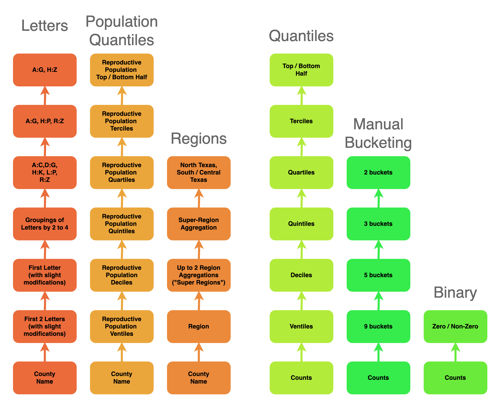

```{r setup, include=TRUE, message=FALSE, echo = FALSE}
knitr::opts_chunk$set(fig.path = "docs/images/", cache = TRUE)

library(kableExtra)
library(knitr)
library(tidyverse)
```

## Background

This script walks through a partial implementation of [Incognito](https://dl.acm.org/doi/10.1145/1066157.1066164), an algorithm proposed by LeFevre et. al, for full-domain $k$-anonymity. The implementation is only partial because when traversing lattices, if a node is found to satisfy the privacy requirement specified, the privacy metric of any child nodes (i.e., generalizations) is also calculated. These computations are unnecessary. 

## Prerequisities

This implementation of partial Incognito requires pre-prepared generalizations of the domain. Using the domain hierarchy below, generalization files are available in the `data` folder.



These files are described below. All the generalizations are based on the scheme specified in the hierarchy above. 

County Names:

* `county_letters.csv` - Generalizations of county names based on letters.
* `county_quantiles.csv` - Generalizations of counties based on county populations.
* `county_regions.csv` - Generalizations of counties based on geographic regions. 

Counts (one set for the ITOP table by county and race and another set for the table by county and age):

* `race_quantiles.csv` and `age_quantiles.csv` - Generalizations of counts based on quantiles. 
* `race_bucketing.csv`and `age_bucketing.csv`- Generalizations of counts based on manual bucketing.
* `race_binary.csv` and `age_binary.csv` - Generalizations based on a binary zero / non-zero classification.

For example, the `county_regions.csv` generalization data for 10 randomly selected counties is previewed below. Columns correspond to the "Regions" generalizations in the hierarchy. 

* `C0` - The original county names
* `C1` - The region associated with the county.
* `C2` - The super-region associated with the county.
* `C3` - Which aggregation of super-region to which the county belongs.
* `C4` - Whether the county belongs to North Texas or South / Central Texas.
* `C5` - A full generalization to `*`.

```{r, echo = FALSE, message = FALSE}
county_regions <- read_csv("data/county_regions.csv")
county_regions |> sample_n(10) |> select(-1) |> 
  kable(caption = "Preview of generalized county-region data", 
        format = "html") |> 
  kable_styling(bootstrap_options = c("striped", "hover", "responsive"), 
                full_width = F, position = "center") |> scroll_box(width = "100%")
```

The paper specifies that given the generalization hierarchy above, the data encompass 897,314
generalizations of the ITOP table by county and race and 52,344,050 of the table by county and age. The breakdown of possible generalizations given the hierarchy above is shown below.


**County and Race** - There are 5 categories for race (Asian, Black, Hispanic, Other, and White)

* [Letters, Quantiles] $8 * 8^5 = 262144$ generalizations 
* [Letters, Bucketing] $8 * 6^5 = 62208$ generalizations 
* [Letters, Binary] $8 * 3^5 = 1944$ generalizations 
* [Population Qualtiles, Quantiles] $8 * 8^5 = 262144$ generalizations
* [Population Qualtiles, Bucketing] $8 * 6^5 = 62208$ generalizations
* [Population Qualtiles, Binary] $8 * 3^5 = 1944$ generalizations 
* [Regions, Quantiles] $6 * 8^5 = 196608$ generalizations
* [Regions, Bucketing] $6 * 6^5 = 46656$ generalizations
* [Regions, Binary] $6 * 3^5 = 1458$ generalizations

Total: 897,314 possible generalizations

**County and Age** - There are 7 categories for age (under 15, 15 to 19, 20 to 24, 25 to 29, 30 to 34, 35 to 39, and 40 plus)

* [Letters, Quantiles] $8 * 8^7 = 16777216$ generalizations 
* [Letters, Bucketing] $8 * 6^7 = 2239488$ generalizations 
* [Letters, Binary] $8 * 3^7 = 17496$ generalizations 
* [Population Qualtiles, Quantiles] $8 * 8^7 = 16777216$ generalizations
* [Population Qualtiles, Bucketing] $8 * 6^7 = 2239488$ generalizations
* [Population Qualtiles, Binary] $8 * 3^7 = 17496$ generalizations 
* [Regions, Quantiles] $6 * 8^7 = 12582912$ generalizations
* [Regions, Bucketing] $6 * 6^7 = 1679616$ generalizations
* [Regions, Binary] $6 * 3^7 = 13122$ generalizations

Total: 52,344,050 possible generalizations

## Running Partial Incognito Code

The code contains helper functions for Partial Incognito in R and requires the `tidyverse` library.

```{r}
# Generalized function to construct combination-based DataFrames
construct_combination_dataframe <- function(vars, n_comb) {
  result <- data.frame()
  
  # Get the names of the variables
  var_names <- names(vars)
  
  # Generate all combinations of the variable names of size n_comb
  combos <- combn(var_names, n_comb, simplify = FALSE)
  
  # Loop through each combination
  for (combo in combos) {
    # Create a data frame for the combination
    temp_df <- expand.grid(lapply(combo, function(var) vars[[var]]))
    colnames(temp_df) <- combo
    
    # Add missing columns and fill them with NA
    for (col in setdiff(var_names, combo)) {
      temp_df[[col]] <- NA
    }
    
    # Append to the result
    result <- bind_rows(result, temp_df)
  }
  
  return(result)
}

construct_args <- function(df) {
  
  result <- df |>
    rowwise() |>  # Process each row individually
    mutate(
      arg = paste0(names(df)[!is.na(c_across(everything()))],
                   c_across(everything())[!is.na(c_across(everything()))],
                   collapse = ", ")) |>
    ungroup()
  
  return(result)
  
}

process_rows <- function(df_this, df_next, col, col_threshold){
  
  
  values_to_exclude <- df_this |>
    filter({{col}} < col_threshold) |>
    pull(arg)
  
  # df_next_pruned <- df_next |>
  #   filter()
  #
  df_next_pruned <- df_next |>
    filter(!apply(across(everything(), as.character), 1, function(row) {
      any(paste0(names(row), row) %in% values_to_exclude)
    }))
  
  return(df_next_pruned)
}

get_k_value <- function(df, quasi_identifiers){
  df |>
    select(all_of(quasi_identifiers)) |>
    group_by(across(all_of(quasi_identifiers))) |>
    tally() |>
    arrange(n) |>
    pull(n) |>
    min()
}

get_DM_value <- function(df, quasi_identifiers){
  df |>
    select(all_of(quasi_identifiers)) |>
    group_by(across(all_of(quasi_identifiers))) |>
    tally() |>
    ungroup() |>
    select(n) |>
    mutate(n_sq = n^2) |>
    pull(n_sq) |>
    sum()
}

execute_partial_incognito <- function(vars, table_to_gen, priv_metric, priv_threshold){
  
  for (iter in 1:length(vars)) {
    
    print(glue::glue("Starting Iteration: {iter}"))
    
    
    if(iter != length(vars)) {
      
      df_this <- construct_combination_dataframe(vars, iter) |> construct_args()
      df_next <- construct_combination_dataframe(vars, iter + 1) |> construct_args()
      
      df_this <- df_this |> 
        mutate(split_arg = strsplit(arg, ", "),
               k_val = map_dbl(split_arg, ~ get_k_value(table_to_gen, .x))) |> 
        process_rows(df_next, priv_metric, priv_threshold)
      
    }
    
    if(iter == length(vars)) {
      
      partial_incognito_result <- 
        df_this |> 
        mutate(split_arg = strsplit(arg, ", "),
               k_val = map_dbl(split_arg, ~ get_k_value(table_to_gen, .x))) |> 
        filter(k_val >= priv_threshold) |> 
        mutate(dm = map_dbl(split_arg, ~ get_DM_value(table_to_gen, .x))) 
    }
    
    print(glue::glue("Finished Iteration: {iter}"))
    
  }
  return(partial_incognito_result)
}

generate_vars_list <- function(input_type, max_gen_county, max_gen_counts) {
  if (!(input_type %in% c("race", "age"))) {
    stop("Error: input_type must be either 'race' or 'age'.")
  }
  
  vars <- list(
    C = c(0:max_gen_county), 
    A = c(0:max_gen_counts), # age: under 15
    H = c(0:max_gen_counts), # age: 15 to 19
    W = c(0:max_gen_counts), # age: 20 to 24
    B = c(0:max_gen_counts), # age: 25 to 29
    O = c(0:max_gen_counts) # age: 30 to 34
  )
  
  if (input_type == "age") {
    vars$Y <- c(0:max_gen_counts) # age: 35 to 39
    vars$Z <- c(0:max_gen_counts) # age: 40 plus
  }
  
  return(vars)
}
```

The function below, `package_results_partial_incognito()` calls the functions above as needed. It takes 4 inputs:

* `county_df` - The dataframe associated with the county generalizations.
* `count_df` - The dataframe associated with the count generalizations (whether age or race)
* `input_type` - Whether the data correspond to `race` or `age`.
* `file_name` - The name of the file to which the results should be written

Notice that $k ≥ 3$ is hard-coded into the code below. 

```{r, numberLines=TRUE}
package_results_partial_incognito <- function(county_df, count_df, input_type,
                                              file_name) {
  
  county_df <- county_df |> select(-1)
  count_df <- count_df |> select(-1)
  
  df_to_gen <- county_df |> inner_join(count_df)
  
  # Get max generalization count
  # County
  max_gen_county <- max(as.numeric(gsub("C", "", names(county_df))))
  # Counts
  count_df_names <- count_df |> select(starts_with("A")) |> names()
  max_gen_counts <- max(as.numeric(gsub("A", "", count_df_names)))
  
  vars <- generate_vars_list(input_type, max_gen_county, max_gen_counts)
  
  cat("Starting at:", format(Sys.time(), "%Y-%m-%d %H:%M:%S"), "\n")
  start_time <- Sys.time()
  
  result <- execute_partial_incognito(vars, df_to_gen, "k_val", 3) 
  
  end_time <- Sys.time()
  cat("Finished at:", format(end_time, "%Y-%m-%d %H:%M:%S"), "\n")
  elapsed_time <- end_time - start_time
  print(elapsed_time)
  
  # Write result
  output_directory <- "results"
  full_path <- file.path(output_directory, file_name)  
  result |> 
    select(-split_arg) |> 
    write.csv(file = full_path)
}
```

The code outputs updates when it is starting and ending each iteration of the lattice construction. Because the algorithm's run time is exponential in the size of the quasi-identifier, each successive iteration is expected to take longer than the iteration preceding it.  The function also writes a file in which the privacy and utility metrics associated with the generalizations in final iteration can be viewed. 

## Example

Let's say we want to run Partial Incognito on the counties generalized by region (as previewed above) and race counts generalized using the binary specification in the hierarchy. (Because this hierarchy runs only 3 'deep' -- one for the counts themselves, one for the binary zero / non-zero classification, and one for a full generalization to "*" -- this computation is relatively fast compared to others described here.)

First, we retrieve the race data generalized using the binary scheme. A preview of the generalized race data is provided below.

```{r, echo = FALSE, message = FALSE}
race_binary <- read_csv("data/race_binary.csv")

race_binary |> head(10) |> select(-1) |> 
  kable(caption = "Preview of Generalized race-binary data", 
        format = "html") |> 
  kable_styling(bootstrap_options = c("striped", "hover", "responsive"), 
                full_width = F, position = "center") |> scroll_box(width = "100%")
```

Then, we can run Partial Incognito as follows:

```{r, message = TRUE}
package_results_partial_incognito(county_df = county_regions, 
                                  count_df = race_binary,
                                  input_type = "race",
                                  file_name = "race_region_binary_results.csv")
```

## Understanding the Results

A preview of the `results/race_region_binary_results.csv` file generated in the step above is shown below. 

```{r, echo = FALSE, message = FALSE}
results <- read_csv("results/race_region_binary_results.csv")

results |> select(-1:-7) |> head(10)  |> 
  kable(caption = "Preview of Partial Incognito Results", 
        format = "html") |> 
  kable_styling(bootstrap_options = c("striped", "hover", "responsive"), 
                full_width = F, position = "center") |> scroll_box(width = "100%")
```

In the first row, the results show that the generalization `C5, A2, H2, W1, B1, O1` achieves 3-Anonymity and is associated with a Discnernibility Cost of $15248$. 

* `C5` corresponds to the C5 column of the county generalization. As shown above, this is a full generalization to `*`.
* `A2` corresponds to the A2 column of the race generalization data.
* `H2` corresponds to the H2 column of the race generalization data.
* `W1` corresponds to the W1 column of the race generalization data.
* etc.

Visualizations of the utility-privacy tradeoff from various implementations of Partial Incognito applied to this data are available in Figure 5 of our paper.


